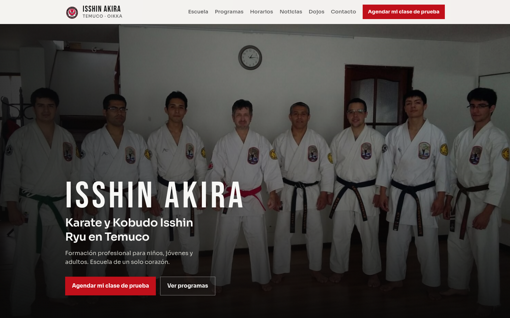
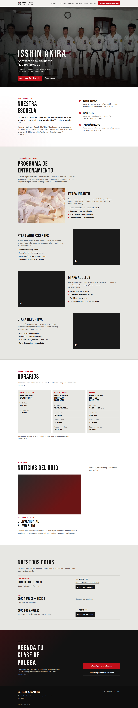
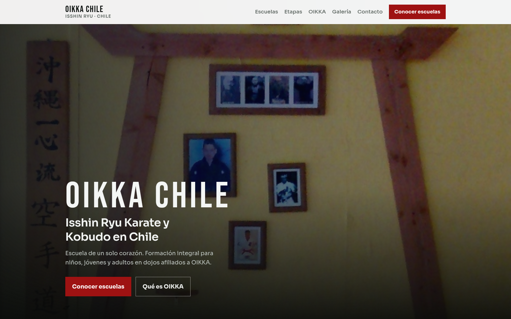
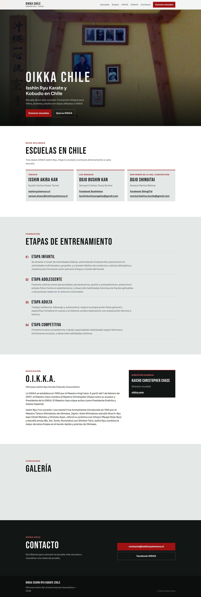
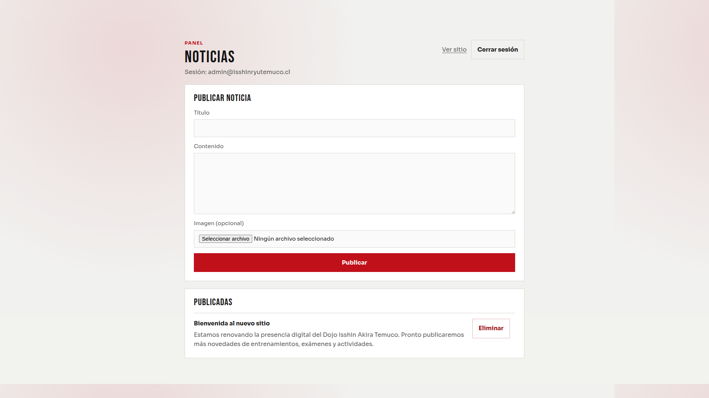
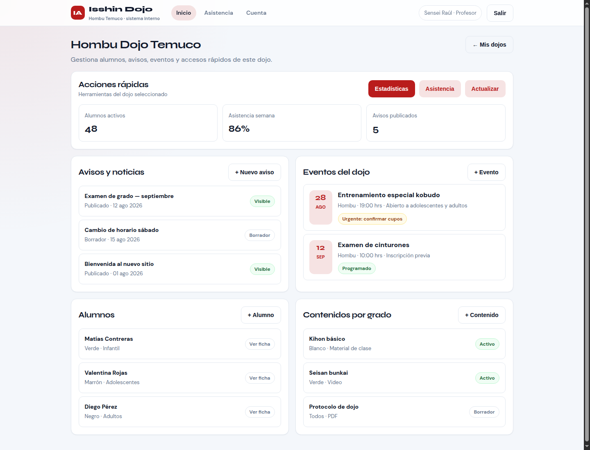
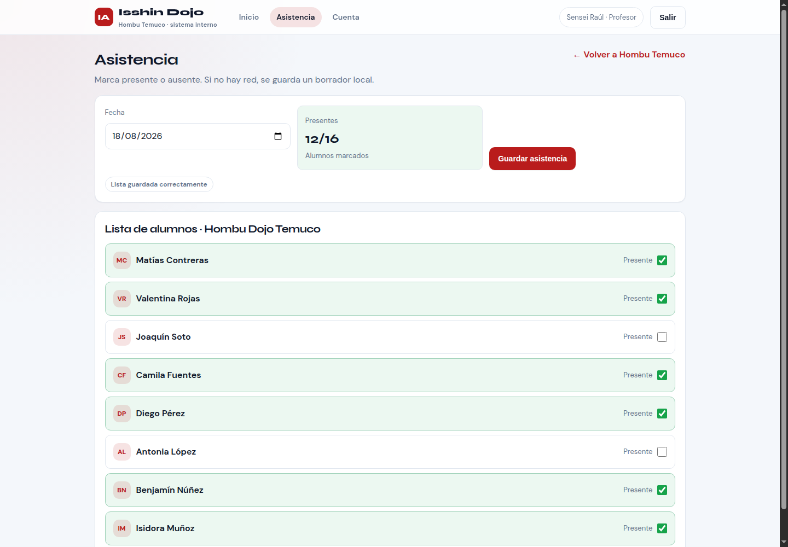

# Propuesta de trabajo  
## Sitios web y apoyo digital para OIKKA Chile y el Dojo Isshin Akira Temuco

**Para:** Dojo Isshin Akira / OIKKA Isshin Ryu Chile  
**De:** Raúl Gutiérrez  
**Fecha:** agosto 2026  
**Válida por:** 30 días  

**Tope por etapa de trabajo:** hasta **$1.000.000** (pesos chilenos).  

> Sobre impuestos: los valores están en pesos. Si se necesita boleta o factura con IVA, se puede agregar aparte; si no, se puede trabajar solo con el monto indicado.

---

## 1. De qué se trata esta propuesta

Hoy existen dos sitios antiguos (Temuco y OIKKA Chile). Ya estamos armando versiones **más modernas y fáciles de usar** en el celular y el computador.

Esta propuesta explica, en simple:

1. **Cuánto cuesta** dejar listos y publicados esos sitios nuevos.  
2. Cómo se pueden **publicar noticias y eventos** sin pedir ayuda cada vez a un técnico.  
3. Cómo más adelante se puede usar un **sistema para el día a día del dojo** (alumnos, asistencia, exámenes), parecido a lo que ya existe en DojApp.  
4. Un **pago mensual** para que los sitios sigan funcionando y con apoyo.

Más abajo hay **capturas y mockups** para que se vea cómo quedan los sitios y las herramientas propuestas.

---

## 2. Cómo se verían los sitios y las herramientas

Las páginas de Temuco y OIKKA Chile son capturas del sitio ya implementado. El panel de noticias es captura real. Los paneles tipo DojApp son mockups de escritorio pensados para Isshin Akira Temuco (sin versión smartphone).

### 2.1 Página del Dojo Temuco (ya implementada)

Carta de presentación del dojo: nombre grande, foto de entrenamiento y botón para agendar clase de prueba.



Landing completa (todas las secciones):



Secciones: escuela · programas · horarios · noticias · dojos · contacto  
(`mockup-temuco-escuela.png`, `mockup-temuco-programas.png`, `mockup-temuco-horarios.png`, `mockup-temuco-noticias.png`, `mockup-temuco-dojos.png`, `mockup-temuco-contacto.png`)

### 2.2 Página OIKKA Chile (ya implementada)

Página de la asociación a nivel país: escuelas y qué es OIKKA.



Landing completa (todas las secciones):



Secciones: escuelas · etapas · asociación · galería · contacto  
(`mockup-oikka-escuelas.png`, `mockup-oikka-etapas.png`, `mockup-oikka-asociacion.png`, `mockup-oikka-galeria.png`, `mockup-oikka-contacto.png`)

### 2.3 Panel para publicar noticias (ya implementado)

Pantalla real del admin: escribir un aviso, agregar foto y publicar.



### 2.4 Panel de avisos y eventos (propuesta Etapa B · Isshin Temuco)

Vista de escritorio estilo DojApp para Hombu Temuco: noticias, eventos, alumnos y contenidos en un mismo lugar.



### 2.5 Sistema de asistencia del dojo (propuesta Etapa C1 · Isshin Temuco)

Vista de escritorio donde el sensei pasa lista en Hombu Temuco (basada en DojApp).



---

## 3. Qué ya está avanzado

| Qué | Estado | Para qué sirve |
|-----|--------|----------------|
| Página del **Dojo Temuco** | Lista | Mostrar el dojo, horarios y agendar clase de prueba |
| **Panel para publicar noticias** (Temuco) | Listo | Subir avisos e imágenes ustedes mismos |
| Página de **OIKKA Chile** | Lista | Mostrar las escuelas del país y qué es OIKKA |
| Todo guardado de forma ordenada | Listo | Se puede mantener y mejorar con el tiempo |

**Páginas actuales (las de hoy en internet):**  
- https://isshinryutemuco.cl/  
- https://www.oikkaisshinryuchile.com/

---

## 4. Trabajo de una sola vez (por etapas)

Cada etapa **no supera $1.000.000**.

### Etapa A — Páginas nuevas en internet · **$980.000**

Incluye el diseño, armar las páginas, pasar los textos del sitio actual, que se vean bien en celular, publicarlas y enseñar lo básico.

| Parte | Qué incluye | Valor |
|-------|-------------|-------|
| Página Dojo Temuco | Presentación, programas, horarios, dojos, contacto y noticias | $380.000 |
| Página OIKKA Chile | Escuelas, etapas, qué es OIKKA, fotos, contacto | $320.000 |
| Panel de noticias | Entrar con usuario y contraseña para publicar o borrar noticias | $200.000 |
| Publicar en internet | Dejar las páginas “al aire” y revisar que todo funcione | $80.000 |
| **Total Etapa A (recomendado)** | Todo lo anterior junto | **$980.000** |

**No está incluido:** comprar un dominio nuevo (solo configurarlo si ya lo tienen), crear correos @isshin…, publicidad en redes, fotos profesionales nuevas, escribir biografías largas desde cero.

---

### Etapa B — Avisos, eventos y fotos desde un panel · **$750.000**

Así no dependen de un técnico para cada cambio. Desde un panel simple podrán:

- Publicar **noticias**  
- Crear **eventos** (fecha, lugar, aviso en la portada)  
- Poner **avisos urgentes** (por ejemplo: se suspende una clase o hay examen)  
- Subir **fotos** a la galería  
- Tener distintas personas con permiso (por ejemplo, alguien de Temuco y alguien de la asociación)

| Ítem | Valor |
|------|-------|
| Armar este panel | **$750.000** |
| Tiempo estimado | unas **4 semanas** |

---

### Etapa C — Sistema del dojo (tipo DojApp), por partes

**DojApp** es un sistema pensado para dojos: registrar alumnos, pasar lista, ver material según el grado y avisar exámenes.  
Aquí se propone ir de a poco, **una parte a la vez**, cada una hasta $1.000.000.

| Parte | Qué se entrega | Valor |
|-------|----------------|-------|
| **C1 · Primero en Temuco (Hombu)** | Entrar al sistema, alumnos, grados y **asistencia** | **$950.000** |
| **C2 · Material y exámenes** | Contenidos según el grado + avisos de examen + resumen simple | **$900.000** |
| **C3 · Otras escuelas** | Sumar Los Ángeles u otras sedes OIKKA | **$850.000** |

No es obligatorio tomar C2 o C3. Se puede quedar solo con C1 si funciona bien.

---

## 5. Pago mensual (para que todo siga andando)

Esto es aparte del trabajo de una sola vez. Sirve para **mantener los sitios en internet**, hacer cambios chicos y, si quieren, ayuda para publicar contenidos.

### Plan Simple · **$65.000 al mes** (Temuco + OIKKA)

- Sitios en internet, seguros y con respaldo  
- Hasta **2 horas al mes** de cambios pequeños (textos, horarios, fotos, arreglos menores)  
- Aviso si el sitio se cae y ayuda para levantarlo  

### Plan con apoyo de publicaciones · **$150.000 al mes**

- Todo lo del Plan Simple  
- Hasta **4 publicaciones al mes** (noticia o evento: texto corto + subirlas al panel)  
- Una propuesta simple de qué publicar en el mes  
- Un solo canal de contacto (WhatsApp o correo)  

### Plan completo (sitios + sistema dojo) · **$280.000 al mes**

- Todo lo del plan anterior  
- Ayuda con el sistema de alumnos/asistencia (altas, permisos, problemas de uso)  
- Hasta **6 horas al mes** de apoyo técnico  
- Actualizaciones importantes de seguridad  

Horas fuera del plan: **$30.000** cada una.

---

## 6. Calendario de trabajo (Gantt)

Ejemplo si se parte a **inicios de septiembre 2026**. Las fechas se pueden mover al firmar.

### Tabla de fechas

| Etapa | Qué pasa | Desde | Hasta |
|-------|----------|-------|-------|
| A · Páginas | Revisar textos y dominios | 01/09/2026 | 07/09/2026 |
| A · Páginas | Ajustes finales Temuco + OIKKA | 08/09/2026 | 17/09/2026 |
| A · Páginas | Publicar y capacitar | 18/09/2026 | 22/09/2026 |
| A · Páginas | **★ Páginas nuevas en internet** | 22/09/2026 | — |
| B · Avisos | Armar panel de eventos y avisos | 23/09/2026 | 12/10/2026 |
| B · Avisos | Probar y dejar listo | 13/10/2026 | 20/10/2026 |
| B · Avisos | **★ Panel de avisos listo** | 20/10/2026 | — |
| C1 · Dojo | Preparar Temuco (usuarios y permisos) | 21/10/2026 | 03/11/2026 |
| C1 · Dojo | Alumnos y asistencia | 04/11/2026 | 24/11/2026 |
| C1 · Dojo | Enseñar al sensei y ajustar | 25/11/2026 | 04/12/2026 |
| C1 · Dojo | **★ Sistema de asistencia en uso** | 04/12/2026 | — |
| C2 (opcional) | Material por grado y exámenes | 05/12/2026 | 01/01/2027 |
| C3 (opcional) | Otras escuelas | 02/01/2027 | 29/01/2027 |
| Mensual | Plan Simple / Publicaciones / Completo | Desde que salgan las páginas | Sigue todo el año |

### En pocas semanas

| Semanas | Meta |
|---------|------|
| 1 | Reunión de inicio, dominios y lista de textos/fotos |
| 2–3 | Páginas nuevas publicadas |
| 4–7 | Panel para noticias y eventos |
| 8–14 | Asistencia en el Hombu Temuco (si se contrata C1) |
| Después | Partes opcionales C2/C3 + plan mensual |

### Línea de tiempo (vista rápida)

```
Páginas nuevas     |████████░░░░░░░░░░░░░░░░|  listas ~22/09
Avisos y eventos   |________████████████░░░░|  listos ~20/10
Asistencia Temuco  |________________████████████|  listo ~04/12
Material/exámenes  |________________________████|  opcional
Otras escuelas     |____________________________████|  opcional
Apoyo mensual      |________████████████████████████|  desde las páginas
                    Sep      Oct      Nov      Dic      Ene
```

---

## 7. Números claros (recomendado)

### Empezar (dentro del tope de $1.000.000)

| Concepto | Monto |
|----------|-------|
| Etapa A — ambas páginas + panel de noticias + publicar | **$980.000** |
| Plan con apoyo de publicaciones (desde que salgan al aire) | **$150.000 al mes** |

### Si más adelante quieren ampliar (cada uno ≤ $1.000.000)

| Concepto | Monto |
|----------|-------|
| Etapa B — avisos, eventos y fotos | $750.000 |
| Etapa C1 — alumnos y asistencia en Temuco | $950.000 |
| Etapa C2 — material y exámenes | $900.000 |
| Etapa C3 — otras escuelas | $850.000 |

---

## 8. Cómo se paga

- **Etapas A y B:** 50% al aceptar · 50% cuando esté publicado y funcionando.  
- **Etapa C (cada parte):** 40% al empezar · 30% al mostrar una versión de prueba · 30% al entregar.  
- **Mensual:** cada mes (por ejemplo el día 5).  
- Planes con publicaciones o sistema dojo: mínimo **3 meses**, después mes a mes.  
- Los sitios quedan para uso de OIKKA / Isshin Akira (detalle por escrito).

---

## 9. Beneficios (en simple)

- Se ven más profesionales en internet (Temuco y Chile).  
- Pueden avisar exámenes, horarios o eventos sin depender siempre de un técnico.  
- Más adelante pueden llevar la **asistencia y los alumnos** en un sistema ordenado.  
- Saben cuánto pagan al mes; no hay sorpresas grandes.

---

## 10. Qué hay que decidir ahora

1. Aprobar la **Etapa A ($980.000)** y un plan mensual (Simple o con publicaciones).  
2. Confirmar los dominios (direcciones de internet) y la fecha de publicación.  
3. Decidir si en el mismo trimestre sigue la Etapa B y/o C1.  
4. Empezar.

---

## 11. Contacto

**Raúl Gutiérrez**  
Sitios web, sistema de dojo y apoyo mensual  

---

## Anexo — ¿Qué es DojApp, en palabras simples?

Es como la “oficina digital” del dojo:

| Función | Para qué sirve en la práctica |
|---------|-------------------------------|
| Alumnos y grados | Saber quién entrena y en qué nivel va |
| Asistencia | Pasar lista en cada clase |
| Material por grado | Que cada alumno vea lo que le corresponde |
| Aviso de examen | Avisarle claro a quien está convocado |
| Varias sedes | Temuco, Los Ángeles u otras escuelas OIKKA |
| Resúmenes | Ver asistencia y avance de forma simple |

Las **páginas web** son la vitrina para quien busca el dojo.  
**DojApp** es la herramienta interna para el día a día.
